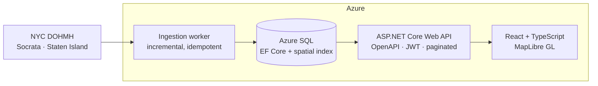

# Freshline

Sales intelligence for companies that sell to restaurants. Freshline takes a city's public
health-inspection data, normalises it into one schema, scores each establishment, and puts the
result on a map you can filter and work through.

**Status: in development.** This README was written before the code, as a design document. Sections describing
behaviour that does not exist yet are marked _(planned)_. Nothing here is claimed as working until it is.

> ### Scope: one source, one area, finished properly
>
> Freshline ingests **one dataset — NYC DOHMH restaurant inspections — filtered to Staten Island.**
> That is the whole scope, and it is a deliberate choice rather than a stopping point I drifted into.
>
> A second city was planned and **cut**. The reasoning is in [the roadmap](docs/roadmap.md#m2--ingest-a-second-city--cut):
> the remaining milestones — spatial queries, API, map UI, scoring, infrastructure, observability —
> are each worth more finished than a second connector is worth started, and every one of them is
> exercised just as hard by one city's data as by three.
>
> The ingestion layer is **architected** so a second source is one connector class and a row of
> configuration (see [ADR-0002](docs/adr/0002-per-source-connectors-and-a-canonical-schema.md)).
> That extension point is designed and unused. It has not been proven by a second implementation,
> and this README does not claim otherwise.
>
> Widening from Staten Island to all five boroughs is a configuration value, not code — 295,294 rows
> instead of 3,237, no migration and no new class.

---

## Why this exists

If you sell to restaurants — food distribution, pest control, POS systems, kitchen equipment, commercial
insurance — the useful question is not "who are the restaurants near me." Every list broker sells that. The
useful question is **"which restaurants are about to need what I sell, and why do I think so."**

That signal is sitting in public data. New York publishes every restaurant inspection in the open, with
coordinates, violation codes and grades, updated within a couple of days. An establishment whose inspection
scores have degraded across three visits, or that just picked up a critical violation on refrigeration, or that
has just been licensed and has no inspection history at all, is a materially different prospect from the one
next door. The city publishes all of that as a compliance record. Nobody publishes it as a sales signal.

Turning the compliance record into the sales signal is what this does.

The honest secondary reason: I wanted to own the whole shape of a system once — schema, ingestion, API,
front end, deployment, monitoring — rather than adding features to architecture somebody else designed. That
is also why the scope is one area rather than many: the interesting problems are vertical, not horizontal.

## What it does

- **Ingests** NYC DOHMH restaurant inspections on a schedule, incrementally, without creating duplicates when
  a run overlaps a previous one.
- **Normalises** the source's shape into one establishment/inspection/violation model — collapsing its
  one-row-per-violation grain, translating six grade values onto a documented scale, and recording what each
  field was mapped from.
- **Scores** each establishment on inspection trend and critical-violation recency, so a salesperson can sort
  by "worth a call" rather than by distance. _(planned)_
- **Maps** the results — clickable establishments coloured by score tier, with a legend, filterable by
  cuisine, grade, and score band. _(planned)_
- **Saves territories** so a user can return to a filtered geographic slice, and get told what changed in it
  since last time. _(planned)_

## Architecture



One source, drawn as one source. The connector sits behind an `ISourceConnector` interface so a second city
would be a new class rather than a change to the pipeline — but no second class exists, and the diagram does
not pretend one does.

Ingestion is a background worker rather than a request-triggered job: the work is periodic, long-running, and
must not be tied to a user waiting on an HTTP response.

Establishments are stored with a SQL Server `geography` point and a spatial index, because every meaningful
query in the product is "what is in this part of the map, matching these filters", and doing that with raw
latitude and longitude comparisons degrades as the row count grows — which is measured rather than asserted at
M3.

**What I would do differently at 100× the volume:** _(to be written once there are real numbers to reason
about — see Measured results)_

## Data source

One dataset. Public, free, no payment tier, no API token. Figures below are from live `count(*)`
calls made on 2026-07-25, not estimates.

**[NYC Open Data — DOHMH Restaurant Inspections](https://data.cityofnewyork.us/Health/NYC-Restaurant-Inspection-Results/gv23-aida)** (`43nn-pn8j`)

| | |
|---|---|
| Grain | One row per violation — 295,294 rows across 31,180 establishments |
| Carries | Grade, score, violation code and description, critical flag, cuisine, coordinates |
| Freshness | Latest inspection was two days old when checked |
| Access | Socrata SODA, unauthenticated. The anonymous rate limit has not been measured and is not claimed here |
| **Ingested** | **Staten Island, from 2025-07-25 — 3,237 rows, 899 establishments, of which 118 hold a permit and have never been inspected** |

Widening the slice to all five boroughs is a configuration value. Adding a different city would be a
new connector class, and there is no plan to write one — see the
[roadmap](docs/roadmap.md#m2--ingest-a-second-city--cut).

[ADR-0002](docs/adr/0002-per-source-connectors-and-a-canonical-schema.md) explains why ingestion is
shaped as a per-source connector behind an interface even with one source, and
[ADR-0003](docs/adr/0003-nyc-identity-grading-and-watermarking-verified.md) records which of
ADR-0002's assumptions survived contact with the actual data. Two of them did not.

## Notable engineering decisions

Full set in [`docs/adr/`](docs/adr/).

- [ADR-0001](docs/adr/0001-record-architecture-decisions.md) — why this project records decisions at all.
- [ADR-0002](docs/adr/0002-per-source-connectors-and-a-canonical-schema.md) — per-source connectors mapping
  into one canonical schema, rather than a shared generic ingester or a table per city.
- [ADR-0003](docs/adr/0003-nyc-identity-grading-and-watermarking-verified.md) — supersedes ADR-0002's
  context after checking it against real API responses. NYC's grading direction held; "grades are
  A/B/C" did not (there are six); and the field that looks like a change timestamp turns out to
  stamp the whole extract, which is why ingestion uses a watermark plus a lookback window.
- [ADR-0004](docs/adr/0004-spatial-types-in-core.md) — why a spatial type is allowed into Core when
  nothing else is, and why the map query uses a bounding box rather than the spatial index that was
  built for it. Both measured rather than argued.

## Measured results

Real measurements only. Full method, execution plans and caveats in
[`docs/performance.md`](docs/performance.md).

**The map list query** — establishments in a viewport with their latest inspection grade, top 50 by
severity. Measured over 23,528 establishments and 29,601 inspections:

| | Logical reads | CPU |
|---|---|---|
| Original: bounding box, two correlated subqueries | 66,536 | 78 ms |
| After: covering index + `CROSS APPLY` | **16,933** | ~15 ms |

**3.9× fewer logical reads.** Roughly half of that came from an `INCLUDE` on the inspections index
removing key lookups, and half from asking for the latest inspection once instead of twice.

**The result that was not expected:** the spatial index made this query **2.4× worse** — 40,359
logical reads against 16,933 — because scanning an 11 MB table once beats 7,290 key lookups into it.
It was kept anyway, because radius search is a question a bounding box cannot express, and there the
same index takes CPU from over 100 ms to unmeasurable. Reasoning in
[ADR-0004](docs/adr/0004-spatial-types-in-core.md).

**Ingestion**, measured on the real backfill: 99,184 rows fetched in 104.6 s. The following
incremental run re-read 12,690 rows through the lookback window, inserted nothing, left every row
count identical, and took 13.4 s.

**What I would do differently at 100× the volume:** _(not yet written — it needs numbers from a
dataset large enough to have different bottlenecks, and 23,528 rows is not it.)_

## Stack

**Backend** — C# / .NET 10, ASP.NET Core Web API, Entity Framework Core, Azure SQL (SQL Server locally)
**Frontend** — React, TypeScript, Vite, MapLibre GL JS
**Infrastructure** — Azure, Bicep, GitHub Actions
**Testing** — xUnit, Vitest, React Testing Library

## Running locally

_These steps have been run on the author's machine but **not yet against a clean clone**. That
verification happens at M10 and until then they are reported, not guaranteed._

```bash
docker compose up -d --wait                       # SQL Server, waits for the healthcheck

dotnet tool restore                               # pins dotnet-ef
export FRESHLINE_CONNECTIONSTRING="Server=localhost,1433;Database=Freshline;User Id=sa;Password=<compose password>;TrustServerCertificate=True"
dotnet ef database update --project src/Freshline.Infrastructure

# The worker reads its connection string from configuration, never from a file in the repo.
export ConnectionStrings__Freshline="$FRESHLINE_CONNECTIONSTRING"
export Ingestion__RunOnce=true
dotnet run --project src/Freshline.Ingestion       # one ingestion pass, then exits
```

`dotnet test` needs the SQL Server container running — the integration tests fail rather than skip
when it is missing, on the grounds that a silently skipped test looks exactly like a passing one.

**[`docs/local-development.md`](docs/local-development.md)** has the rest: how to browse the database
from VS Code, and why Visual Studio 2022 cannot build this project at all (it is the .NET 10 target,
not the `.slnx` solution file).

_(The API and web app are still the M0 scaffolds; they arrive at M4 and M5.)_

## What's next

Current milestone and everything not yet built are tracked in [`docs/roadmap.md`](docs/roadmap.md).

## Engineering log

[`docs/ai-engineering-log.md`](docs/ai-engineering-log.md) records how AI tooling was used on this project per
milestone — what was delegated, what was kept, what was rejected, and how it was verified. Including the
places where I took the tool's word for something.

## Licence

MIT — see [LICENSE](LICENSE).
