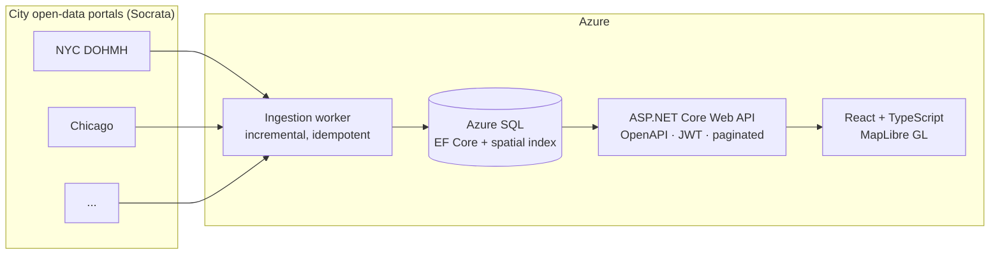

# Freshline

Sales intelligence for companies that sell to restaurants. Freshline aggregates public health-inspection and
business-licence data from city open-data portals, normalises it into one schema, scores each establishment,
and puts the result on a map you can filter and work through.

**Status: in development.** This README was written before the code, as a design document. Sections describing
behaviour that does not exist yet are marked _(planned)_. Nothing here is claimed as working until it is.

---

## Why this exists

If you sell to restaurants — food distribution, pest control, POS systems, kitchen equipment, commercial
insurance — the useful question is not "who are the restaurants near me." Every list broker sells that. The
useful question is **"which restaurants are about to need what I sell, and why do I think so."**

That signal is sitting in public data. Health inspection results are published by most large US cities, in the
open, with coordinates. An establishment whose inspection scores have degraded across three visits, or that
just picked up a critical violation on refrigeration, or that has just been licensed and has no inspection
history at all, is a materially different prospect from the one next door. Nobody is joining that up, because
each city publishes it in a different shape and none of them publish it as a sales signal.

Freshline is the join.

The honest secondary reason: I wanted to own the whole shape of a system once — schema, ingestion, API,
front end, deployment, monitoring — rather than adding features to architecture somebody else designed.

## What it does

- **Ingests** inspection and licence data from multiple city open-data portals on a schedule, incrementally,
  without creating duplicates when a run overlaps a previous one.
- **Normalises** the wildly different per-city schemas into one establishment/inspection/violation model, and
  records exactly what each source field was mapped from.
- **Scores** each establishment on inspection trend, critical-violation recency, and licence age, so a
  salesperson can sort by "worth a call" rather than by distance. _(planned)_
- **Maps** the results — clickable establishments coloured by score tier, with a legend, filterable by city,
  cuisine, grade, and score band. _(planned)_
- **Saves territories** so a user can return to a filtered geographic slice, and get told what changed in it
  since last time. _(planned)_

## Architecture



Ingestion is a background worker rather than a request-triggered job: the work is periodic, long-running, and
must not be tied to a user waiting on an HTTP response. Each source has its own connector implementing a
common interface, so adding a city is a new connector and a row of configuration, not a change to the pipeline.

Establishments are stored with a SQL Server `geography` point and a spatial index, because every meaningful
query in the product is "what is in this part of the map, matching these filters" and doing that with raw
latitude/longitude comparisons stops working as soon as there is more than one city in the database.

**What I would do differently at 100× the volume:** _(to be written once there are real numbers to reason
about — see Measured results)_

## Data sources

All public, all free, no payment tier. Row counts below are from live `count(*)` calls made on
2026-07-25, not estimates.

| Source | What it provides | Rows | Status |
|---|---|---|---|
| [NYC Open Data — DOHMH Restaurant Inspections](https://data.cityofnewyork.us/Health/NYC-Restaurant-Inspection-Results/gv23-aida) (`43nn-pn8j`) | One row per violation, with grade, score, violation code, cuisine and coordinates, across 31,180 establishments | 295,294 | **Ingested** (M1 — Staten Island slice only) |
| [Chicago — Food Inspections](https://data.cityofchicago.org/d/4ijn-s7e5) (`4ijn-s7e5`) | One row per inspection, violations packed into a text field | 313,268 | _Access verified, no connector yet — M2_ |
| [Los Angeles — Restaurant and Market Health Inspections](https://data.lacity.org/d/29fd-3paw) (`29fd-3paw`) | One row per inspection, with score and grade | 67,573 | _Access verified, no connector yet_ |

All three are reachable over Socrata SODA without a token; that was confirmed by calling them. The
anonymous rate limit has not been measured and is not claimed here. Chicago's and LA's *schemas* have
not been verified either — only that the data is there and free.

**M1 ingests one slice**: NYC, Staten Island, inspections from 2025-07-25 onward — 3,237 rows,
including 118 establishments that hold a permit and have never been inspected. Small on purpose, so
the schema can go through a revision cheaply. Widening the slice is configuration; adding a city is a
connector.

Per-city schema differences are the point, not an obstacle — see
[ADR-0002](docs/adr/0002-per-source-connectors-and-a-canonical-schema.md), and
[ADR-0003](docs/adr/0003-nyc-identity-grading-and-watermarking-verified.md) for which of ADR-0002's
assumptions survived contact with the actual data.

## Notable engineering decisions

Full set in [`docs/adr/`](docs/adr/).

- [ADR-0001](docs/adr/0001-record-architecture-decisions.md) — why this project records decisions at all.
- [ADR-0002](docs/adr/0002-per-source-connectors-and-a-canonical-schema.md) — per-source connectors mapping
  into one canonical schema, rather than a shared generic ingester or a table per city.
- [ADR-0003](docs/adr/0003-nyc-identity-grading-and-watermarking-verified.md) — supersedes ADR-0002's
  context after checking it against real API responses. NYC's grading direction held; "grades are
  A/B/C" did not (there are six); and the field that looks like a change timestamp turns out to
  stamp the whole extract, which is why ingestion uses a watermark plus a lookback window.

## Measured results

Deliberately empty. This section will hold real before/after numbers — query timings with execution plans,
ingestion throughput, index impact — or it will stay empty. It will not hold estimates.

## Stack

**Backend** — C# / .NET 10, ASP.NET Core Web API, Entity Framework Core, Azure SQL (SQL Server locally)
**Frontend** — React, TypeScript, Vite, MapLibre GL JS
**Infrastructure** — Azure, Bicep, GitHub Actions
**Testing** — xUnit, Vitest, React Testing Library

## Running locally

_These steps have been run on the author's machine but **not yet against a clean clone**. That
verification happens at M10 and until then they are reported, not guaranteed._

```bash
docker compose up -d --wait                       # SQL Server, waits for the healthcheck

dotnet tool restore                               # pins dotnet-ef
export FRESHLINE_CONNECTIONSTRING="Server=localhost,1433;Database=Freshline;User Id=sa;Password=<compose password>;TrustServerCertificate=True"
dotnet ef database update --project src/Freshline.Infrastructure

# The worker reads its connection string from configuration, never from a file in the repo.
export ConnectionStrings__Freshline="$FRESHLINE_CONNECTIONSTRING"
export Ingestion__RunOnce=true
dotnet run --project src/Freshline.Ingestion       # one ingestion pass, then exits
```

`dotnet test` needs the SQL Server container running — the integration tests fail rather than skip
when it is missing, on the grounds that a silently skipped test looks exactly like a passing one.

_(The API and web app are still the M0 scaffolds; they arrive at M4 and M5.)_

## What's next

Current milestone and everything not yet built are tracked in [`docs/roadmap.md`](docs/roadmap.md).

## Engineering log

[`docs/ai-engineering-log.md`](docs/ai-engineering-log.md) records how AI tooling was used on this project per
milestone — what was delegated, what was kept, what was rejected, and how it was verified. Including the
places where I took the tool's word for something.

## Licence

MIT — see [LICENSE](LICENSE).
