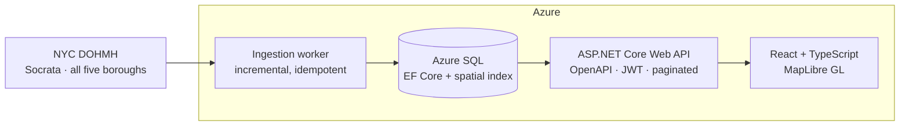

# Freshline

Sales intelligence for companies that sell to restaurants. Freshline takes a city's public
health-inspection data, normalises it into one schema, scores each establishment, and puts the
result on a map you can filter and work through.

**Status: in development.** This README was written before the code, as a design document. Sections describing
behaviour that does not exist yet are marked _(planned)_. Nothing here is claimed as working until it is.

> ### Scope: one source, one area, finished properly
>
> Freshline ingests **one dataset — NYC DOHMH restaurant inspections, all five boroughs.**
> That is the whole scope, and it is a deliberate choice rather than a stopping point I drifted into.
>
> A second city was planned and **cut**. The reasoning is in [the roadmap](docs/roadmap.md#m2--ingest-a-second-city--cut):
> the remaining milestones — spatial queries, API, map UI, scoring, infrastructure, observability —
> are each worth more finished than a second connector is worth started, and every one of them is
> exercised just as hard by one city's data as by three.
>
> The ingestion layer is **architected** so a second source is one connector class and a row of
> configuration (see [ADR-0002](docs/adr/0002-per-source-connectors-and-a-canonical-schema.md)).
> That extension point is designed and unused. It has not been proven by a second implementation,
> and this README does not claim otherwise.
>
> M1 ran a single borough — Staten Island, 3,237 rows — deliberately, so the schema could go through
> a revision cheaply while it was still unsettled. M3 widened it to the whole city, which was a
> configuration value rather than code: no migration, no new class. The result, counted rather than
> estimated on 2026-07-26: **23,528 establishments, 29,601 inspections, 94,400 violations** from
> 99,050 retained source records.

---

## Why this exists

If you sell to restaurants — food distribution, pest control, POS systems, kitchen equipment, commercial
insurance — the useful question is not "who are the restaurants near me." Every list broker sells that. The
useful question is **"which restaurants are about to need what I sell, and why do I think so."**

That signal is sitting in public data. New York publishes every restaurant inspection in the open, with
coordinates, violation codes and grades, updated within a couple of days. An establishment whose inspection
scores have degraded across three visits, or that just picked up a critical violation on refrigeration, or that
has just been licensed and has no inspection history at all, is a materially different prospect from the one
next door. The city publishes all of that as a compliance record. Nobody publishes it as a sales signal.

Turning the compliance record into the sales signal is what this does.

The honest secondary reason: I wanted to own the whole shape of a system once — schema, ingestion, API,
front end, deployment, monitoring — rather than adding features to architecture somebody else designed. That
is also why the scope is one area rather than many: the interesting problems are vertical, not horizontal.

## What it does

- **Ingests** NYC DOHMH restaurant inspections on a schedule, incrementally, without creating duplicates when
  a run overlaps a previous one.
- **Normalises** the source's shape into one establishment/inspection/violation model — collapsing its
  one-row-per-violation grain, translating six grade values onto a documented scale, and recording what each
  field was mapped from.
- **Scores** each establishment on inspection trend and critical-violation recency, so a salesperson can sort
  by "worth a call" rather than by distance. _(planned)_
- **Maps** the results — clickable establishments coloured by inspection outcome, with a legend,
  filterable by cuisine, borough, outcome and never-inspected, and a detail panel carrying the full
  inspection history. Coloured by *outcome* rather than by score, because the scoring above is still
  planned and a colour has to mean something today.
- **Reports** on the data in aggregate — how results distribute across boroughs or cuisines, filtered
  by area and date range, sortable, exportable to CSV. Rankings sort by what the evidence supports
  rather than by raw percentage, so a cuisine with two establishments does not outrank one with four
  hundred; see [ADR-0007](docs/adr/0007-reports-assert-conclusions.md).
- **Saves territories** so a user can return to a filtered geographic slice, and get told what changed in it
  since last time. _(planned)_

## Architecture



One source, drawn as one source. The connector sits behind an `ISourceConnector` interface so a second city
would be a new class rather than a change to the pipeline — but no second class exists, and the diagram does
not pretend one does.

Ingestion is a background worker rather than a request-triggered job: the work is periodic, long-running, and
must not be tied to a user waiting on an HTTP response.

Establishments are stored with a SQL Server `geography` point and a spatial index, because every meaningful
query in the product is "what is in this part of the map, matching these filters", and doing that with raw
latitude and longitude comparisons degrades as the row count grows — which is measured rather than asserted at
M3.

**What I would do differently at 100× the volume:** _(to be written once there are real numbers to reason
about — see Measured results)_

## Data source

One dataset. Public, free, no payment tier, no API token. Figures below are from live `count(*)`
calls made on 2026-07-25, not estimates.

**[NYC Open Data — DOHMH Restaurant Inspections](https://data.cityofnewyork.us/Health/NYC-Restaurant-Inspection-Results/gv23-aida)** (`43nn-pn8j`)

| | |
|---|---|
| Grain | One row per violation — 295,294 rows across 31,180 establishments |
| Carries | Grade, score, violation code and description, critical flag, cuisine, coordinates |
| Freshness | Latest inspection was two days old when checked |
| Access | Socrata SODA, unauthenticated. The anonymous rate limit has not been measured and is not claimed here |
| **Ingested** | **All five boroughs, from 2025-07-25 — 99,050 retained source records giving 23,528 establishments, 29,601 inspections and 94,400 violations. 3,605 of those establishments hold a permit and have never been inspected.** Counted 2026-07-26 |

M1 ingested one borough — 3,237 rows, 899 establishments — so the schema could be revised cheaply
while it was still unsettled. M3 widened it to the whole city, which was a configuration value rather
than code. Adding a different *city* would be a new connector class, and there is no plan to write one
— see the [roadmap](docs/roadmap.md#m2--ingest-a-second-city--cut).

[ADR-0002](docs/adr/0002-per-source-connectors-and-a-canonical-schema.md) explains why ingestion is
shaped as a per-source connector behind an interface even with one source, and
[ADR-0003](docs/adr/0003-nyc-identity-grading-and-watermarking-verified.md) records which of
ADR-0002's assumptions survived contact with the actual data. Two of them did not.

## Notable engineering decisions

Full set in [`docs/adr/`](docs/adr/).

- [ADR-0001](docs/adr/0001-record-architecture-decisions.md) — why this project records decisions at all.
- [ADR-0002](docs/adr/0002-per-source-connectors-and-a-canonical-schema.md) — per-source connectors mapping
  into one canonical schema, rather than a shared generic ingester or a table per city.
- [ADR-0003](docs/adr/0003-nyc-identity-grading-and-watermarking-verified.md) — supersedes ADR-0002's
  context after checking it against real API responses. NYC's grading direction held; "grades are
  A/B/C" did not (there are six); and the field that looks like a change timestamp turns out to
  stamp the whole extract, which is why ingestion uses a watermark plus a lookback window.
- [ADR-0004](docs/adr/0004-spatial-types-in-core.md) — why a spatial type is allowed into Core when
  nothing else is, and why the map query uses a bounding box rather than the spatial index that was
  built for it. Both measured rather than argued.
- [ADR-0005](docs/adr/0005-public-read-surface-and-token-validation.md) — why the map is anonymous and
  stays anonymous, with rate limiting rather than a login as the bound on open use; and why the API
  validates JWTs with an asymmetric key it cannot sign with, so that "this service does not issue
  tokens" is a property of the cryptography rather than a promise about restraint.
- [ADR-0006](docs/adr/0006-trusting-the-ingress-not-the-caller.md) — supersedes ADR-0005's instruction
  to identify the proxy by address, which turned out to be unfollowable on the platform this deploys
  to. How a per-caller rate limit survives behind an ingress when `X-Forwarded-For` is written by the
  caller, why the number of proxies is the safer thing to configure than a list of their addresses,
  and what assumption that leaves standing.

- [ADR-0007](docs/adr/0007-reports-assert-conclusions.md) — why a report is held to a higher standard
  than a map: it asserts a conclusion rather than drawing data. How a ranking avoids putting a
  two-establishment cuisine above a four-hundred-establishment one, why the fix sorts rows without
  changing the percentage printed in them, and what it still does not make true.

## Measured results

Real measurements only. Full method, execution plans and caveats in
[`docs/performance.md`](docs/performance.md).

**The map list query** — establishments in a viewport with their latest inspection grade, top 50 by
severity. Measured over 23,528 establishments and 29,601 inspections:

| | Logical reads | CPU |
|---|---|---|
| Original: bounding box, two correlated subqueries | 66,536 | 78 ms |
| After: covering index + `APPLY` | **16,933** | ~15 ms |

**3.9× fewer logical reads.** Roughly half of that came from an `INCLUDE` on the inspections index
removing key lookups, and half from asking for the latest inspection once instead of twice.

**The follow-up that mattered more than the speed-up.** M4 found that the improved query used
`CROSS APPLY` — an inner join, which silently dropped every establishment that had never been
inspected. Across the whole table it returned **19,923 of 23,528 rows**; the 3,605 missing are exactly
those awaiting a first inspection, which is the greenfield signal the product is partly built on. It
ran, returned thousands of rows, and looked entirely healthy. No performance measurement could have
caught it, because the fastest way to answer a question is to answer less of it. `OUTER APPLY` returns
1,307 more rows over the same viewport for an identical **16,947** logical reads — **the wrong answer
was not buying any speed.**

**A conclusion that reversed on being measured again.** Against the M3 indexes, EF Core's generated
SQL cost 1.6× a hand-written `OUTER APPLY`, and the obvious inference was to drop this query to raw
SQL. That was wrong. EF's window function was expensive because it scanned the *clustered* index; once
a narrow covering index could answer it, the same plan fell from 2,809 logical reads to **132 — 21×**
— and the gap to hand-written SQL closed to 7%. **The fix was the index, not the ORM.**

**Keyset pagination, measured against depth** — `Establishments` logical reads, EF's own SQL:

| Page (row) | Keyset | `OFFSET` |
|---|---|---|
| 1 (row 1) | 16 | 16 |
| 100 (row 4,951) | 21 | 78 |
| 201 (row 10,001) | 21 | 142 |
| 461 (row 23,001) | **9** | **307** |

Keyset is flat; `OFFSET` grows linearly, because the rows before the page still have to be produced
and thrown away.

**The result that was not expected:** the spatial index made this query **2.4× worse** — 40,359
logical reads against 16,933 — because scanning an 11 MB table once beats 7,290 key lookups into it.
It was kept anyway, because radius search is a question a bounding box cannot express, and there the
same index takes CPU from over 100 ms to unmeasurable. Reasoning in
[ADR-0004](docs/adr/0004-spatial-types-in-core.md).

**Ingestion**, measured on the real backfill: 99,184 rows fetched in 104.6 s. The following
incremental run re-read 12,690 rows through the lookback window, inserted nothing, left every row
count identical, and took 13.4 s.

**The map's basemap, after three rounds of chasing the wrong cause.** Panning was reported as janky,
twice more after fixes that did not fix it. Two hypotheses died by measurement — pin count was
identical either side of the rough zone, and layer count was *higher* in the smooth one. Measuring the
tiles themselves found the actual cause:

| Zoom | Vector `.mvt` | Raster `.png` @2x |
|---|---|---|
| 12 | 98 KB | 30 KB |
| 14 | **389 KB** | 26 KB |
| 15+ | **HTTP 400 — does not exist** | — |

The map was overzooming a tile set that stops at z14. Now raster geometry with vector labels above
z14 only. **Smoothness itself was not measured** — the user said it was better, which is the right
instrument for that question and is not a number.

**Colour, measured rather than assumed.** The intuitive green-for-good / red-for-bad pair separates by
ΔE 4.1 under deuteranopia — the two states a reader most needs to tell apart, rendered nearly
identical for the most common form of colour blindness. The shipped scale was chosen on measured
separation instead.

**What I would do differently at 100× the volume:** _(not yet written — it needs numbers from a
dataset large enough to have different bottlenecks, and 23,528 rows is not it.)_

**Cold-start cost of the deployed map:** _(not yet written — nothing is deployed. A scale-to-zero
container in front of an auto-pausing database makes the first visitor wait, and the figure that
matters can only come from the real thing.)_

## Stack

**Backend** — C# / .NET 10, ASP.NET Core Web API, Entity Framework Core, Azure SQL (SQL Server locally)
**Frontend** — React, TypeScript, Vite, MapLibre GL JS
**Infrastructure** — Azure, Bicep, GitHub Actions
**Testing** — xUnit, Vitest, React Testing Library

## Running locally

_These steps have been run on the author's machine but **not yet against a clean clone**. That
verification happens at M10 and until then they are reported, not guaranteed._

```bash
docker compose up -d --wait                       # SQL Server, waits for the healthcheck

dotnet tool restore                               # pins dotnet-ef
export FRESHLINE_CONNECTIONSTRING="Server=localhost,1433;Database=Freshline;User Id=sa;Password=<compose password>;TrustServerCertificate=True"
dotnet ef database update --project src/Freshline.Infrastructure

# The worker reads its connection string from configuration, never from a file in the repo.
export ConnectionStrings__Freshline="$FRESHLINE_CONNECTIONSTRING"
export Ingestion__RunOnce=true
dotnet run --project src/Freshline.Ingestion       # one ingestion pass, then exits
```

`dotnet test` needs the SQL Server container running — the integration tests fail rather than skip
when it is missing, on the grounds that a silently skipped test looks exactly like a passing one.

**[`docs/local-development.md`](docs/local-development.md)** has the rest: how to browse the database
from VS Code, and why Visual Studio 2022 cannot build this project at all (it is the .NET 10 target,
not the `.slnx` solution file).

```bash
# The API. Serves the OpenAPI document and a browsable UI at /scalar/v1 in every environment.
export ConnectionStrings__Freshline="$FRESHLINE_CONNECTIONSTRING"
dotnet run --project src/Freshline.Api
```

_(The web app is still the M0 scaffold; it arrives at M5.)_

## The API

Seven endpoints under `/api/v1`, documented by an OpenAPI document served in **every** environment —
not just development — because the read paths are public by design and the document describes nothing
a caller could not discover by using it. A browsable UI is at `/scalar/v1`.

| | |
|---|---|
| `GET /establishments` | Filtered list, ordered by name, paged by cursor |
| `GET /establishments/map` | Everything inside a viewport, not paged |
| `GET /establishments/{id}` | One establishment with its full inspection history |
| `GET /establishments/filter-options` | The values the filters can match, and where each borough is |
| `GET /establishments/summary` | Counts describing the dataset, for the landing page |
| `GET /reports/outcome-breakdown` | Results by borough or cuisine, with sample sizes |
| `GET /me` | The claims on your bearer token — the only endpoint needing one |

Plus `/health` (liveness, runs no checks) and `/health/ready` (readiness, reaches the database).

**The report endpoint has its own rate-limit budget**, separate from the rest. A report aggregates
over a large share of the table and is asked for rarely; a map query is small and constant. Sharing
one bucket meant a handful of reports could lock somebody out of the map, and brisk panning could
lock them out of the reports.

**The three establishment endpoints are anonymous and stay that way.** The data is NYC's published
record and the value of this API is that it can simply be opened and used. What bounds open use is a
per-IP token-bucket rate limiter, not a login. JWT validation exists alongside it so M6 has identity
to hang saved territories on, using an asymmetric key the API cannot sign with — reasoning in
[ADR-0005](docs/adr/0005-public-read-surface-and-token-validation.md).

Every failure path returns RFC 9457 `ProblemDetails`, including the ones produced by middleware rather
than by an endpoint: a 429 from the rate limiter and a 401 from the auth handler are the same shape as
a 400 from validation.

A few details that are decisions rather than defaults:

- **Paging is by cursor, never `OFFSET`.** Flat cost with depth, measured above. There is no total
  count and no page number — a caller pages until `nextCursor` is null.
- **Establishments with no inspections are returned**, with a null `latestInspection`, everywhere.
  They are 3,605 of 23,528 rows and they are the signal, not missing data.
- **The map endpoint is not paged.** A cursor is for walking a list to its end; a map client pans, and
  a viewport it has left is not worth resuming. It reports `isTruncated` instead.
- **Nulls are serialised, not omitted**, so a caller never has to distinguish "absent" from "null".
  A grade is null on 11,358 of the inspections in this dataset; that is a fact about the data and the
  response should say it.
- **Invalid input is refused rather than corrected.** `pageSize=5000` is a 400, not a silent clamp to
  200 — a caller who believes they received a complete answer will page wrongly and never see an
  error.

## What's next

Current milestone and everything not yet built are tracked in [`docs/roadmap.md`](docs/roadmap.md).

## Engineering log

[`docs/ai-engineering-log.md`](docs/ai-engineering-log.md) records how AI tooling was used on this project per
milestone — what was delegated, what was kept, what was rejected, and how it was verified. Including the
places where I took the tool's word for something.

## Licence

MIT — see [LICENSE](LICENSE).
